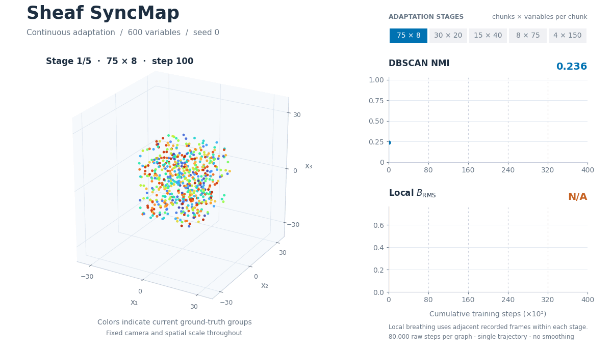

# Sheaf SyncMap

A minimal implementation of original SyncMap, decentralized SyncMap, and Sheaf
SyncMap, with continuous adaptation and a two-factor ablation experiment.



*Sheaf SyncMap adapting across five graph stages, with 80,000 raw steps per graph.
Points are colored by the current ground-truth groups. NMI and local B_RMS use
the full recorded traces, with breathing computed separately within each stage;
animation frames are subsampled for playback. This is a single seed-0 trajectory,
not the paper's multi-seed average.*

## Installation

Use Python 3.11 or newer. From this directory, in your preferred environment:

```bash
python -m pip install -e '.[test]'
```

The experiments run from this source checkout. All five input graphs are bundled;
no downloaded datasets, previous results, Graphviz, or private repository are needed.
CUDA is selected when available, otherwise CPU. The standard model uses NumPy on CPU.

## Experiments

```bash
make ablation_test
make adaption_test
```

Both use seed **0**, three-dimensional maps, dynamic working memory, and
**80,000 raw random-walk steps per graph**, in this order:

**75×8 → 30×20 → 15×40 → 8×75 → 4×150** (chunks × variables per chunk).

Singleton working-memory states are filtered as in the original experiments, so
processed-step boundaries can be slightly below multiples of 80,000. The model
is created once and fitted once to the concatenated sequence. Coordinates,
coactivation trackers, repulsion history, and the cumulative sheaf step counter
persist across stages. Input RNG and working memory reset separately per graph.
The model's historical `fix_seed` behavior initializes coordinates with seed 42;
the experiment seed controls input walks. The sheaf launches at processed step 5,000.

`ablation_test` runs these four fresh conditions sequentially:

| Condition | Directional history | Implicit sheaf |
|---|---|---|
| Decentralized SyncMap | Off | Off |
| Decentralized + directional history | On | Off |
| Decentralized + sheaf | Off | On |
| Sheaf SyncMap | On | On |

`adaption_test` runs only Sheaf SyncMap. Standard SyncMap is available through the
Python API and is not included in either experiment. The spelling `adaption_test`
is intentional.

The graph order and training length match the reported ablation NMI experiment.
These defaults run only seed 0; the reported figure averaged seeds 0–3 for the
decentralized and full Sheaf reference curves and used seed 0 for the two partial
variants. This release does not claim to reproduce those averaged curves from one seed.

Common numerical settings live in `configs/defaults.yaml`; condition matrices
live in `configs/ablation.yaml` and `configs/adaption.yaml`. Runtime overrides:

```bash
make ablation_test ARGS='--device cpu --steps 20 --valid-every 5 --sheaf-launch-delay 5 --quiet'
make adaption_test ARGS='--device cpu --steps 20 --valid-every 5 --sheaf-launch-delay 5 --quiet'
```

These are short execution checks, not research results. `ARGS` also supports
`--seed`, `--threads`, and `--output-dir`. Use `PYTHON=/path/to/python` with Make
to choose an interpreter. PyTorch uses one CPU thread by default; adjust
`train.num_threads` or `--threads` for your hardware.

## Outputs

Each invocation creates a fresh directory under
`tb_logs/YYYY-MMDD/YYYY-MMDD-HHMMSS-<experiment>-<run-id>/`, with a parent manifest
and one `<arm>/seed-0/` leaf per condition. Each completed leaf includes:

- TensorBoard events and resolved `artifacts/config/params.json`.
- `artifacts/config/provenance.json` with configuration, graph, and input hashes.
- `artifacts/metrics.json` with the original final-window DBSCAN epsilon sweep.
- `artifacts/traces/*.npz` with coordinates, NMI, within-chunk mean pairwise
  distances, and local breathing traces, evaluated separately within each stage.
- `artifacts/adaptation/boundary_coordinates.npz` with initial and stage-final states.
- `artifacts/status.json` and incremental diagnostics for failure inspection.


## Python models

```python
import numpy as np
from src.models import StandardSyncMap

model = StandardSyncMap(input_size=6, dimensions=3, adaptation_rate=0.0005)
sequence = np.array([[1, 1, 0, 0, 0, 0], [0, 0, 1, 1, 0, 0]], dtype=bool)
model.fit(sequence)
coordinates = model.syncmap
```

`src.models.NodeSyncMap` is the shared decentralized/Sheaf model. Its
`single_direction_repel_history` Boolean and `radial_regularization.mode`
(`baseline` or `implicit`) select the two mechanisms. Directional history requires
aligned `transition_edges` of shape `(steps, 2)` when calling `fit`; invalid
transitions use `(-1, -1)`. The experiment runner prepares this metadata.

Licensed under Apache-2.0; see `LICENSE`.
